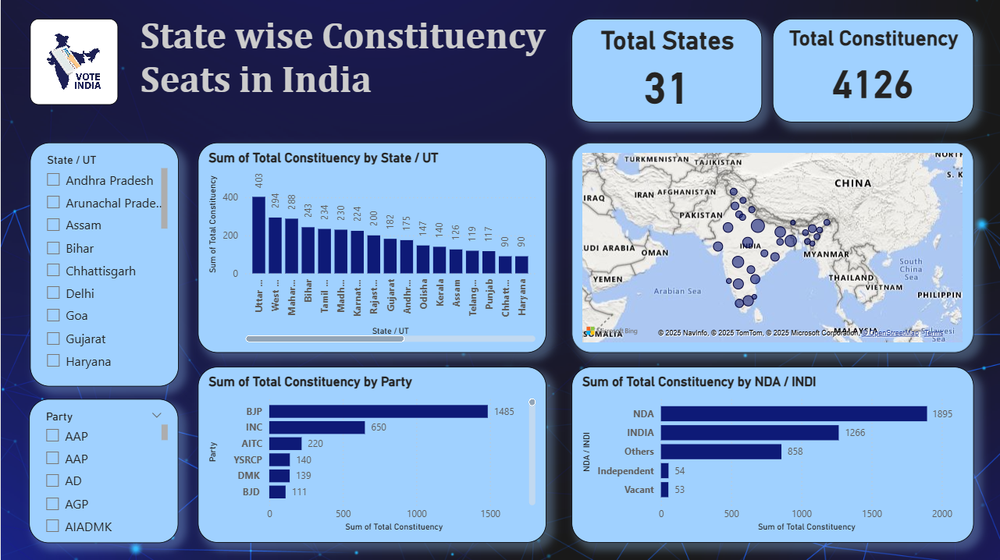

# State-wise Constituency Seats in India – Basic Power BI Dashboard

## 📌 Overview
This repository contains an **interactive Power BI dashboard** showcasing **state-wise constituency seats** across India.  
It enables users to explore:
- Distribution of constituencies by **State / UT**
- Party-wise seat distribution
- NDA vs. INDI alliance comparison
- Geographic representation on a map

---

## 🖼 Dashboard Preview

---

## 📂 Files in this Repository
- **`states.pbix`** – The Power BI project file (editable in Power BI Desktop)
- **`dashboard_image.png`** – Dashboard screenshot for quick preview
- **`State Wise Constituency Seats.xlsx`** - Excel dataset used to build the dashboard

---

## 📊 Key Insights
- **Uttar Pradesh** holds the maximum constituencies (403 seats)
- NDA alliance has the highest total seat share
- Party-level breakdown shows **BJP** leading with **1485 seats**
- Interactive filters for **State/UT** and **Party** enable deeper exploration

---

## 🛠 How to Use
1. **Download** the `.pbix` file from this repository.
2. **Install** [Power BI Desktop](https://powerbi.microsoft.com/desktop/).
3. Open the file in Power BI Desktop to interact with slicers, filters, and charts.

---

## 📄 License
This project is shared under the **MIT License** – you may use, modify, and distribute it freely.

---

⭐ If you found this dashboard useful, please give this repo a star and share your feedback!  
